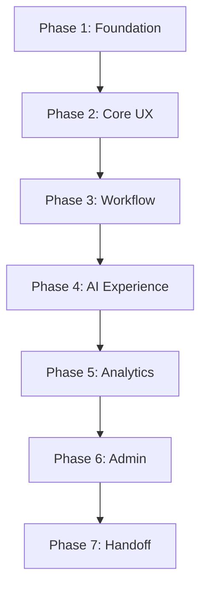

# Sachin's Development Roadmap

A structured timeline mapping out development phases.

## Phases Summary

### Phase 1 — Foundation (Week 1)
* Establish Next.js structure, configure tailwind styles, customize theme parameters, and configure mock data architecture.

### Phase 2 — Core UX (Week 2)
* Implement Landing Page, Registration/Login forms, Candidate Portal, Recruiter Dashboard layout, and jobs list.

### Phase 3 — Recruitment Workflow (Week 3)
* Implement Kanban Board drag components, Interview scheduler forms, and Offer response screens.

### Phase 4 — AI Experience (Week 3-4)
* Implement Resume Uploading views and AI parsing/matching visualizations.

### Phase 5 — Analytics (Week 4)
* Implement data tables, charts, KPI widgets, and status tracking feeds.

### Phase 6 — Admin (Week 4)
* Implement user management grids, system logs panels, and settings forms.

### Phase 7 — Quality & Handoff (Week 5)
* Implement responsive designs, write unit tests, complete documentation, and initiate handoff to Shivam.
